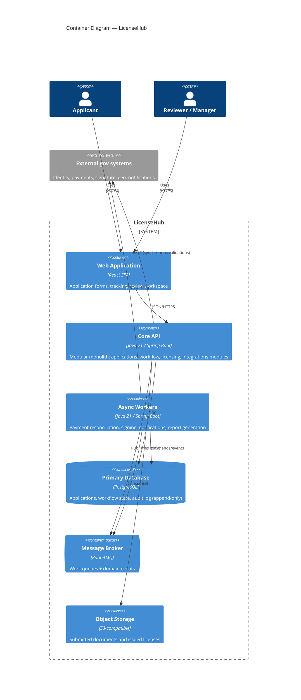

# C4 — Level 2: Containers

Inside the LicenseHub system boundary. Structure follows [ADR-0002](../adr/0002-modular-monolith-over-microservices.md) (modular monolith) and [ADR-0004](../adr/0004-async-processing-with-message-queue.md) (async workers).

## Key properties

- **One deployable API** (modular monolith) + **one worker deployable** — small team, low operational surface, clean async boundary.
- The **audit log is append-only** in PostgreSQL ([ADR-0003](../adr/0003-postgresql-as-primary-datastore.md)) — the 20-year traceability requirement is a data-design concern, not a separate system.
- Everything that talks to slow/unreliable external systems runs in workers, keeping API latency predictable.
