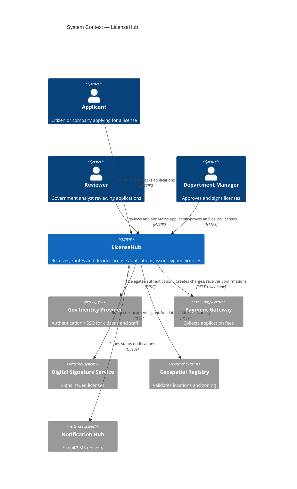

# C4 — Level 1: System Context

LicenseHub sits between citizens/companies applying for licenses and the government systems that support the process.

## Notes

- All human access goes through the Gov Identity Provider — LicenseHub stores no passwords ([ADR-0002](../adr/0002-modular-monolith-over-microservices.md) discusses the internal structure behind the single system boundary shown here).
- Payment confirmation is asynchronous by nature (webhook), which is one of the drivers for [ADR-0004](../adr/0004-async-processing-with-message-queue.md).
